# مخطط علاقات الكيانات — ERD (النطاقات الـ12)

الجداول بخط عادي منفَّذة في المرحلة 1؛ الجداول الموسومة `(P2+)` مخططة وموثقة كتعليقات في `convex/schema.ts`.
العلاقات تُبنى على `_id` الخاص بـConvex؛ `businessId` للعرض والمراسلات.

```mermaid
erDiagram
  %% ===== Domain 1: Customer =====
  customers ||--o{ customerPreferences : has
  customers ||--o{ customerConsents_P2 : has

  %% ===== Domain 2: Sales & CRM =====
  customers ||--o{ leads : becomes
  leads ||--o{ quotes : receives
  products ||--o{ quotes : "built on version"
  customers ||--o{ interactions : exchanges
  leads ||--o{ interactions : about
  customers ||--o{ channelIdentities : "reached via"
  bookings ||--o{ followUps : "lifecycle messages"
  customers ||--o{ followUps : receives
  approvals ||--o| followUps : gates
  interactions ||--o| tasks : "handled by (support)"
  tasks ||--o| tasks : "escalationOf"

  %% ===== Domain 3: Tourism Product =====
  products ||--o{ productComponents : contains
  products ||--o{ itineraries : "day plan"
  products ||--o| products : supersedes
  rates ||--o{ productComponents : prices
  hotels ||--o{ productComponents : uses
  experiences ||--o{ productComponents : uses

  %% ===== Domain 4: Destination & Experience =====
  destinations ||--o{ attractions : has
  destinations ||--o{ experiences : hosts
  destinations ||--o{ hotels : located_in
  destinations }o--o{ products : covers
  destinations ||--o{ routes_P2 : connects

  %% ===== Domain 5: Supplier & Contract =====
  suppliers ||--o{ hotels : operates
  suppliers ||--o{ experiences : operates
  suppliers ||--o{ contracts : signs
  suppliers ||--o{ vehicles_P2 : owns
  suppliers ||--o{ guides_P2 : employs
  documents ||--o| contracts : "scanned copy"

  %% ===== Domain 6: Rates & Commercial =====
  suppliers ||--o{ rates : quotes
  hotels ||--o{ rates : "room rates"
  experiences ||--o{ rates : "activity rates"
  contracts ||--o{ rates : governs
  documents ||--o{ rates : "extracted from"
  decisionRegister ||--o{ pricingRules : authorizes

  %% ===== Domain 7: Booking & Operations =====
  customers ||--o{ bookings : books
  leads ||--o| bookings : converts
  quotes ||--o| bookings : accepted_as
  products ||--o{ bookings : sells
  bookings ||--o{ bookingServices : consists_of
  bookingServices ||--o| confirmationEvidence : proven_by
  suppliers ||--o{ bookingServices : delivers
  rates ||--o{ bookingServices : priced_by
  bookings ||--o| trips_P2 : executed_as
  trips_P2 ||--o| tripReadiness_P2 : checked_by
  trips_P2 ||--o{ incidents_P2 : reports

  %% ===== Domain 8: Finance (P2+) =====
  bookings ||--o{ invoices_P2 : billed
  invoices_P2 ||--o{ payments_P2 : settled_by
  payments_P2 ||--o{ refunds_P2 : reversed_by
  bookings ||--o| profitability_P2 : measured

  %% ===== Domain 9: Quality, Risk & Compliance (P2+) =====
  qaReviews_P2 }o--|| tasks : reviews
  riskRegister_P2 }o--o| decisionRegister : mitigated_by
  complianceRecords_P2 }o--o| documents : evidenced_by

  %% ===== Domain 10: Legal & Regulatory (P2+) =====
  legalKnowledge_P2 }o--o| documents : sourced_from
  regulatoryChanges_P2 }o--o| decisionRegister : triggers
  legalHolds_P2 }o--|| customers : freezes

  %% ===== Domain 11: Corporate, HR & Admin =====
  policies ||--o| documents : "canonical text"
  policies ||--o| policies : supersedes
  sops ||--o| documents : "canonical text"
  decisionRegister }o--o| approvals : "recorded from"
  decisionRegister }o--o| tasks : "raised by"
  humanStaff_P2 }o--o| users : "login"

  %% ===== Domain 12: Digital, Tech & Analytics =====
  agents ||--o{ tasks : executes
  tasks ||--o{ tasks : "subtasks (parent/root)"
  tasks ||--o{ taskRuns : steps
  tasks ||--o{ approvals : requests
  tasks ||--o{ usageLog : "model calls"
  approvals ||--o{ auditLog : decided
  tasks ||--o{ auditLog : traced
  agents ||--o{ dataAccessMatrix : granted
  agents ||--o{ toolRegistry : allowed
  tasks ||--o{ dataConflicts : raised
  tasks ||--o{ knowledgeGaps : raised
  campaigns ||--o{ contentCalendar : schedules
  products ||--o{ contentCalendar : promotes
  contentCalendar }o--o{ digitalAssets : uses
  approvals ||--o| contentCalendar : publishes
  conversations ||--o{ chatMessages : has
  conversations ||--o{ tasks : spawns
  users ||--o{ conversations : owns
  workflowRegistry_P2 }o--|| agents : runs
  integrationRegistry_P2 ||--o{ interactions : channel
  kpiDefinitions_P2 }o--|| usageLog : "cost KPIs"

  %% ===== Knowledge & memory =====
  documents ||--o{ knowledgeChunks : "indexed as"
  documents ||--o| documents : supersedes
  agents ||--o{ memories : proposes
  tasks ||--o{ memories : "context of"
  customers ||--o{ memories : subject
  suppliers ||--o{ memories : subject

  %% ===== Platform =====
  counters ||..|| customers : "businessId seq"
  settings ||..|| agents : "model routing"
  refCurrencies ||..o{ rates : "exchange rate"
  refServiceTypes ||..o{ rates : "serviceType code"
  users ||--o{ auditLog : acts
```

## ملاحظات
- `auditLog` إلحاقي فقط ويشير إلى أي جدول عبر `(table, recordId)`.
- `knowledgeChunks` يحمل نسخة منزوعة المعايرة من `lifecycle`/`allowedAgents`/`classification` للتصفية؛ المستند هو مصدر الحقيقة ويُعاد التحقق عند الاسترجاع.
- `tasks.transcript` يخزّن محادثة النموذج (مزوّد-مستقلة) حتى يمكن إيقاف المهمة واستكمالها بعد الاعتماد أو المهام الفرعية.
- الجداول المرجعية: `refCountries`, `refCurrencies`, `refLanguages`, `refServiceTypes`, `refPaymentMethods`, `refCancellationTypes`.
